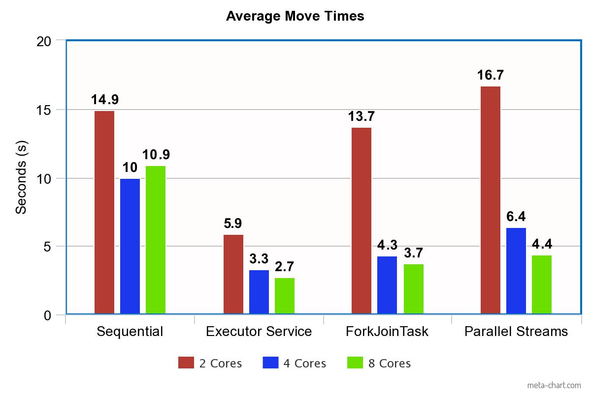

# Welcome to our Multi-threaded Chess AI!

## To run our code, see the "Steps to run our parallel code" section
[Or click here](#steps-to-run-our-parallel-code)

## Abstract:
For complex problems whose solutions tend to be time-consuming, one of the ways to improve runtime is through parallelization. Even for artificial intelligence (AI) algorithms that play complex games like chess, we can break down the processing time by parallelizing its main algorithm. This paper will be used to explore this potential in performance. We will use an algorithm that is commonly used in chess AIs called Alpha-Beta-Pruning. Alpha-Beta-Pruning is an optimization of the Minimax algorithm, which is used to find the best move in a 2-player game. By itself, the Alpha Beta algorithm increases the processing speed of the searching algorithm, but we plan to improve its performance using parallelization. Using Java, we successfully implemented three parallelizations of the Alpha Beta pruning algorithm, each using different parallelization methods. We then compare the performance of these parallelized versions to the sequential version, to determine if there was any improvement, and evaluate which technique was most effective.

Our finished paper can be found in this repo @ Final-Paper.pdf
 
## Disclaimer! We did not build this chess game! 
The original repo can be found here: https://github.com/amir650/BlackWidow-Chess

We needed a way to test our multi-threaded AI within the context of a chess game, and this open-source code served as our medium for testing.

The creator of this chess game also made an excellent tutorial to follow along: https://www.youtube.com/playlist?list=PLOJzCFLZdG4zk5d-1_ah2B4kqZSeIlWtt

The work-in-progress folder represents the progress we made following this tutorial before switching to the finished code due to time constraints

These are the changes we made to the original code to implement our parallelized code:
- Added the 'ParallelAlphaBetaWithMoveOrdering' class (A parellized version of the sequential 'AlphaBetaWithMoveOrdering' class)
- Added the 'TranspositionTable' class
- Edited the 'Board' class, adding methods to support Zobrist Hashing

## Steps to run our parallel code:
1. Clone this GitHub Repository
2. Open the 'ChessAI' folder in a terminal
3. Change Directory into the 'functional-chess-game folder' (The path should look like this: ChessAI\functional-chess-game)
4. Use the following command to compile the code: javac -d ./bin -cp ./lib/guava-18.0.jar -sourcepath ./src ./src/com/chess/Driver.java
5. To run the code: java -cp "./bin;./lib/guava-18.0.jar" com.chess.Driver
6. Click the options tab and select setup game
7. Here you can choose to either have the computer play itself by selecting computer for both players, or play against it yourself.
8. Information regarding calcuated move times, ordered move list, prune cutoff percentage, and more will output to console

## IMPORTANT NOTE!
By default the game will run our most efficient, executor-service implementation.

## To use other parallel implementations:
In the ParallelAlphaBetaWithMoveOrdering file located at: com\chess\engine\classic\player\ai, all three parallel implementations are contained in the code. 

Two will be commented out, and the one currently being used is uncommented. To switch implementations, simply uncomment the one you would like to use, and comment out the other.

## To use sequential implementation:
On Line 502 of the 'Table' class located at: com\chess\gui, currently the sequential AlphaBetaWithMoveOrdering class is commented out. 
To use the sequential implementation instead of the parallel, simply uncomment this line, and comment line 505, where the parallel code is called.
To switch back, simply reverse these steps.

## The old-code folder:
This folder contains the parallel alpha-beta code we made before applying it to a chess game. This version of the code was much slower than the sequential, and underwent many changes. 

## The Results of our experiment:

